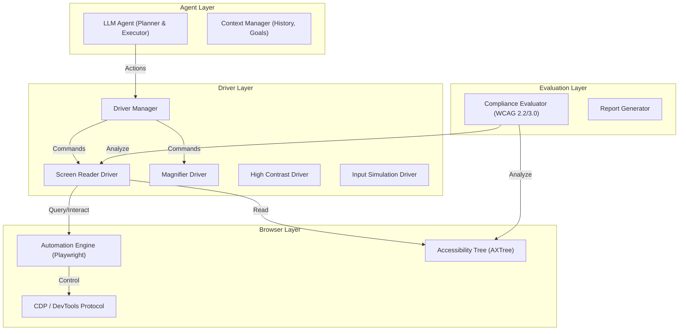

# Accessibility Driver Framework: Technical Design & Roadmap

## 1. Architecture Overview

The system follows a **Layered Architecture** designed to decouple the simulation of assistive technology (AT) from the underlying browser automation and the high-level decision-making agent.

### High-Level Diagram



### Layers Description

1.  **Browser Automation Layer**:
    *   **Role**: Handles raw interaction with the browser instance.
    *   **Tech**: Playwright (Node.js/TypeScript).
    *   **Key Responsibility**: Exposing the Chrome DevTools Protocol (CDP) to fetch the full Accessibility Tree (`Accessibility.getFullAXTree`) and handle raw input events.

2.  **Driver Layer**:
    *   **Role**: The core simulation engine. Each "Driver" implements a common interface but behaves differently.
    *   **Key Components**:
        *   `ScreenReaderDriver`: Maintains a "Virtual Cursor" and traverses the AXTree linearly or spatially.
        *   `MagnifierDriver`: Manipulates the viewport and zoom levels, tracking focus.
        *   `HighContrastDriver`: Enforces media queries and overrides styles.

3.  **Agent Layer**:
    *   **Role**: The "User". It receives the *perceptual* output from the Driver (e.g., "Link: Home", "Heading Level 1: Dashboard") rather than the raw DOM.
    *   **Logic**: Uses an LLM to plan a path to a goal (e.g., "Find the 'Sign Up' button") based *only* on what the Driver perceives.

4.  **Evaluation Layer**:
    *   **Role**: The "Judge". It monitors the interaction.
    *   **Detection**:
        *   **Passive**: Static analysis of the AXTree (e.g., missing names).
        *   **Active**: Interaction failures (e.g., Agent tried to click "Submit" but nothing happened because it was a `div` without a click handler or keyboard support).

---

## 2. Driver Simulation Requirements

### Common Interface (`IAccessibilityDriver`)

```typescript
interface IAccessibilityDriver {
  name: string;
  // The agent "sees" or "hears" this
  getPerceptualOutput(): Promise<PerceptualSnapshot>; 
  // The agent performs these actions
  performAction(action: UserAction): Promise<ActionResult>;
  // Setup/Teardown
  enable(): Promise<void>;
  disable(): Promise<void>;
}
```

### A. Screen Reader Driver (SR-Sim)

**Simulation Goal**: Mimic NVDA/JAWS behavior, specifically the distinction between **Browse Mode** (Virtual Cursor) and **Focus Mode** (Interaction).

*   **Browser Hooks**:
    *   `CDP.Accessibility.getFullAXTree`: To build the virtual buffer.
    *   `CDP.DOM.getBoxModel`: To visualize the cursor.
*   **Semantics & Navigation**:
    *   **Virtual Buffer**: Flatten the AXTree into a linear sequence of "Nodes".
    *   **Navigation Heuristics**:
        *   *Next Element*: Move index +1 in the flattened tree.
        *   *Next Heading*: Scan forward for `role="heading"`.
    *   **Output Generation**: Construct a string based on `name`, `role`, `value`, `description`, and `state` (e.g., "expanded", "invalid").
*   **Focus Order**:
    *   Must respect `tabindex`. When `Tab` is pressed, query the browser for the next focusable element and sync the Virtual Cursor to it.

### B. Screen Magnifier Driver

**Simulation Goal**: Mimic ZoomText or macOS Zoom.

*   **Simulation**:
    *   **Viewport**: Use CSS `transform: scale(N)` on the `body` or use CDP emulation to resize the viewport to a smaller area, effectively "zooming in" on a portion of the page.
    *   **Focus Tracking**: When focus changes (or mouse moves), the viewport must programmatically scroll to keep the target in view.
    *   **Artifacts**: The Agent's "vision" input (screenshot) should be cropped to the current magnified viewport to simulate the limited field of view.

### C. High Contrast / Color Blindness Driver

**Simulation Goal**: Windows High Contrast Mode or Protanopia/Deuteranopia.

*   **Implementation**:
    *   **High Contrast**: Inject CSS to force colors (e.g., Yellow on Black) and remove background images. Use `Emulation.setEmulatedMedia` with `forced-colors: active`.
    *   **Color Blindness**: Inject an SVG filter over the entire document body to shift colors.

### D. Braille Display Driver

**Simulation Goal**: Refreshable Braille Display (1 line of text).

*   **Simulation**:
    *   **Output**: Convert the current Screen Reader text item into Braille ASCII or Unicode patterns.
    *   **Refresh Cycle**: Update only when the Virtual Cursor moves. Limit output to 40 or 80 cells.

---

## 3. Real-Time Visualization Layer

A debugging UI is essential for human observation.

*   **Components**:
    1.  **Live Mirror**: A view of the browser page.
    2.  **Overlay Layer**:
        *   **SR Focus**: A thick colored border (e.g., Red) around the element the Virtual Cursor is currently on.
        *   **Keyboard Focus**: A dashed border (e.g., Blue) around the element with system focus.
    3.  **Transcript Panel**: Scrolling log of what the Screen Reader "spoke".
        *   `[SR] "Navigation Region"`
        *   `[SR] "List with 5 items"`
        *   `[SR] "Link: About Us"`
    4.  **Action Log**:
        *   `[Agent] Pressed 'H' (Next Heading)`
        *   `[Agent] Pressed 'Enter'`

---

## 4. ADA/WCAG Violation Detection Agent

The Agent is the core intelligence. It doesn't just "scan"; it "tries".

### Workflow
1.  **Goal**: "Find the contact form and send a message."
2.  **Observation**: Agent gets the SR Output (e.g., "Top of page. Link: Skip to content...").
3.  **Action**: Agent decides to press `H` to find a heading.
4.  **Violation Detection**:
    *   *Scenario*: Agent presses `H` but the driver reports "No next heading", yet the visual snapshot shows big bold text "Contact Us".
    *   *Violation*: **WCAG 1.3.1 Info and Relationships** (Visual heading not marked as semantic heading).
    *   *Scenario*: Agent tabs to a button, but the SR says "Unlabeled graphic".
    *   *Violation*: **WCAG 1.1.1 Non-text Content** (Missing accessible name).
    *   *Scenario*: Agent tries to trigger a custom dropdown with `Enter` or `Space`, but nothing changes in the AXTree.
    *   *Violation*: **WCAG 2.1.1 Keyboard** (Control not keyboard accessible).

### Reporting
*   **Machine Readable**: JSON format compatible with SARIF.
*   **Human Readable**: Markdown report with screenshots of the failure state and a "Replay Script" to reproduce the path.

---

## 5. Implementation Details

### Tech Stack
*   **Language**: **TypeScript** (Strong typing for AXNodes, seamless integration with Playwright).
*   **Browser Automation**: **Playwright**.
    *   *Why?* Best-in-class support for Chrome DevTools Protocol (CDP), which is required for `Accessibility.getFullAXTree`. Puppeteer is also good, but Playwright's test runner and selector engines are superior for the "Agent" layer.
*   **LLM Integration**: **OpenAI SDK** or **LangChain.js**.
    *   *Model*: **GPT-4o** or **Gemini 1.5 Pro** (Multimodal is essential for comparing Visual vs. Semantic trees).

### Plugin Architecture
Drivers should be implemented as classes that implement `IAccessibilityDriver`.
*   `DriverManager` loads drivers at runtime.
*   Each driver registers "Capabilities" (e.g., `supports_visual_output`, `supports_speech_output`).

### Multi-Modal Support
*   **Audio**: Use Web Speech API or a TTS library (e.g., `say` on macOS, `espeak` on Linux) to generate real audio files for the "Video Export" of the session.
*   **Braille**: Output raw Unicode Braille patterns (e.g., `⠓⠑⠇⠇⠕`) to the log.

---

## 6. Dataset + Evaluation

### Datasets
1.  **Synthetic Violation Suite**: Create a suite of minimal HTML files each containing a specific WCAG violation (e.g., `img` without `alt`, `button` with `tabindex="-1"`, `div` acting as button).
2.  **W3C "Before and After" Demo**: Use the official W3C accessibility demonstration site.
3.  **Real-World Crawl**: A curated list of top 100 websites known to have varying levels of accessibility.

### Evaluation Metrics
*   **Precision**: `True Violations / (True Violations + False Positives)`
*   **Recall**: `True Violations / Total Known Violations`
*   **Agent Success Rate**: Can the agent complete the user journey (e.g., "Checkout") despite the accessibility barriers?

---

## 7. Deliverables & Roadmap

### Phase 1: Proof of Concept (Weeks 1-4)
*   [ ] Implement `ScreenReaderDriver` (Basic linear navigation).
*   [ ] Build `Agent` loop with simple goal ("Find X").
*   [ ] Create Visualization UI (Simple HTML overlay).
*   [ ] Test on Synthetic Violation Suite.

### Phase 2: Advanced Drivers (Weeks 5-8)
*   [ ] Implement `MagnifierDriver` and `HighContrastDriver`.
*   [ ] Add "Focus Mode" vs "Browse Mode" to Screen Reader.
*   [ ] Integrate Multimodal LLM (Vision) for "Visual vs Semantic" checks.

### Phase 3: Scale & Polish (Weeks 9-12)
*   [ ] Parallel execution (Multiple agents testing multiple pages).
*   [ ] Generate PDF/HTML Reports.
*   [ ] CI/CD Integration (GitHub Action).

### Pseudocode: Screen Reader Driver

```typescript
class ScreenReaderDriver implements IAccessibilityDriver {
  private axTree: AXNode[];
  private virtualCursorIndex: number = 0;
  private mode: 'BROWSE' | 'FOCUS' = 'BROWSE';

  constructor(private page: Page) {}

  async syncTree() {
    const session = await this.page.context().newCDPSession(this.page);
    const { nodes } = await session.send('Accessibility.getFullAXTree');
    this.axTree = this.flattenTree(nodes);
  }

  async performAction(action: UserAction): Promise<ActionResult> {
    if (action.type === 'KEY_PRESS') {
      if (this.mode === 'FOCUS' || this.isInteractionKey(action.key)) {
        // Pass through to browser
        await this.page.keyboard.press(action.key);
        await this.syncTree(); // Tree might change
      } else {
        // Handle virtual navigation
        this.handleVirtualKey(action.key);
      }
    }
    return this.getPerceptualOutput();
  }

  private handleVirtualKey(key: string) {
    if (key === 'ArrowDown') {
      this.virtualCursorIndex = Math.min(this.virtualCursorIndex + 1, this.axTree.length - 1);
    } else if (key === 'H') {
      this.virtualCursorIndex = this.findNextRole('heading');
    }
    // ... handle other keys
  }

  async getPerceptualOutput(): Promise<PerceptualSnapshot> {
    const node = this.axTree[this.virtualCursorIndex];
    const spokenText = `${node.role} ${node.name ? node.name : 'unlabeled'}`;
    return {
      text: spokenText,
      cursorBox: await this.getBoundingBox(node.backendDOMNodeId)
    };
  }
}
```

## 8. Risks and Mitigations

*   **Risk**: **AXTree Latency**. Fetching the full tree on every interaction might be slow for large pages.
    *   *Mitigation*: Use `Accessibility.getPartialAXTree` or cache the tree and only update on `CDP.Accessibility.nodesUpdated` events.
*   **Risk**: **LLM Hallucination**. The agent might "invent" violations.
    *   *Mitigation*: Strict grounding. The agent must cite the specific AXNode ID and Rule ID for every violation.
*   **Risk**: **Dynamic Content**. Single Page Apps (SPAs) might update the DOM without alerting the driver.
    *   *Mitigation*: Listen to `MutationObserver` in the browser context and trigger a tree refresh.

